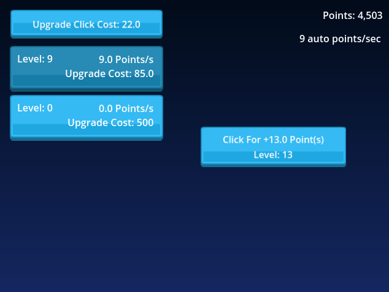

# Godot Auto Clicker Mechanics
Simple Godot 4.4 project showing how an upgrade system works with idle clicker games. This was originally from another GIT repository, that was getting a bit outdated. It didn't have a screenshot and was on an older version of Godot. I just some updates and made it more accessible. The original repository had a lot of unused graphics and fonts, so I decided to make a clean repo instead of forking.

Demo on itch: https://scottpetrovic.itch.io/auto-clicker-demo

Original repository it is based off of: https://github.com/Tyler-Osborne/ClickMeGodot

